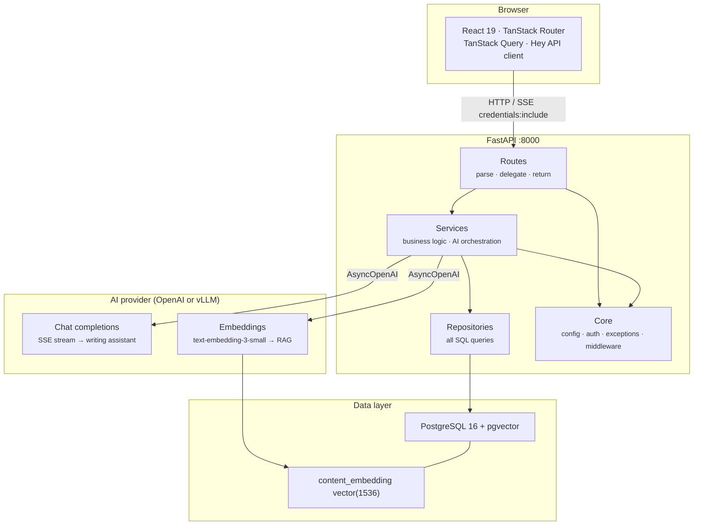
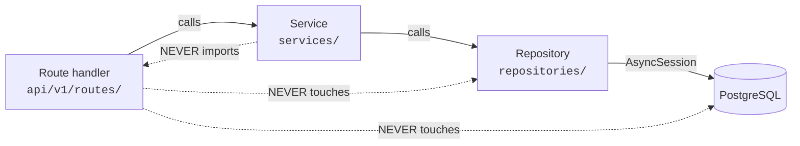
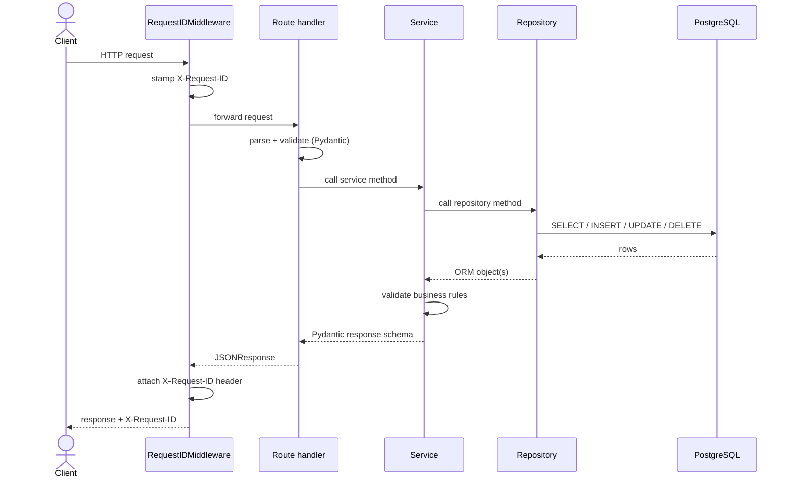
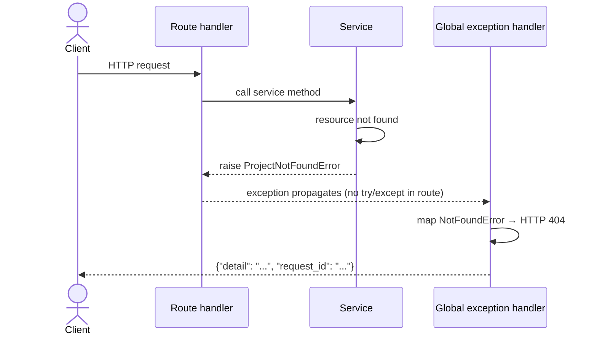
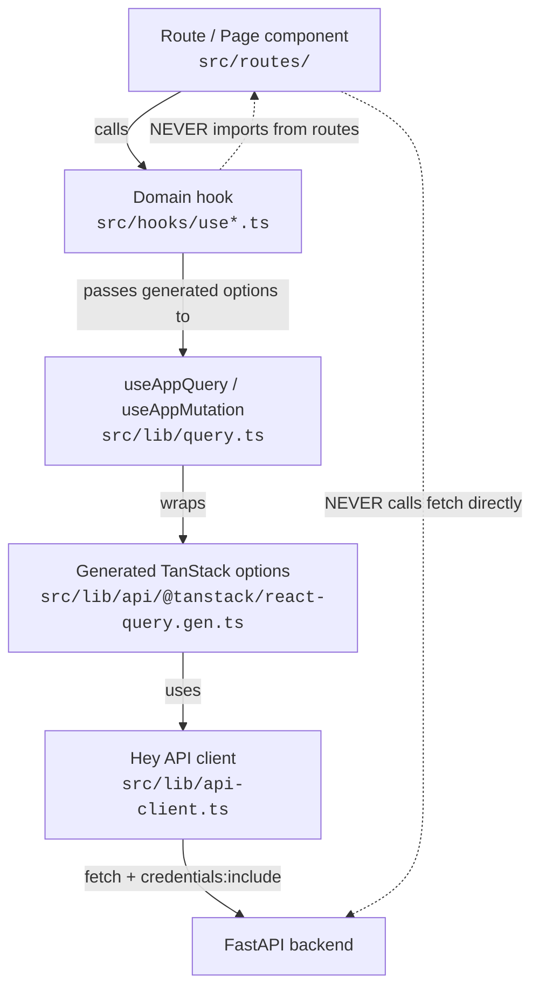
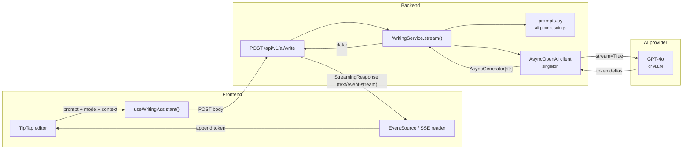
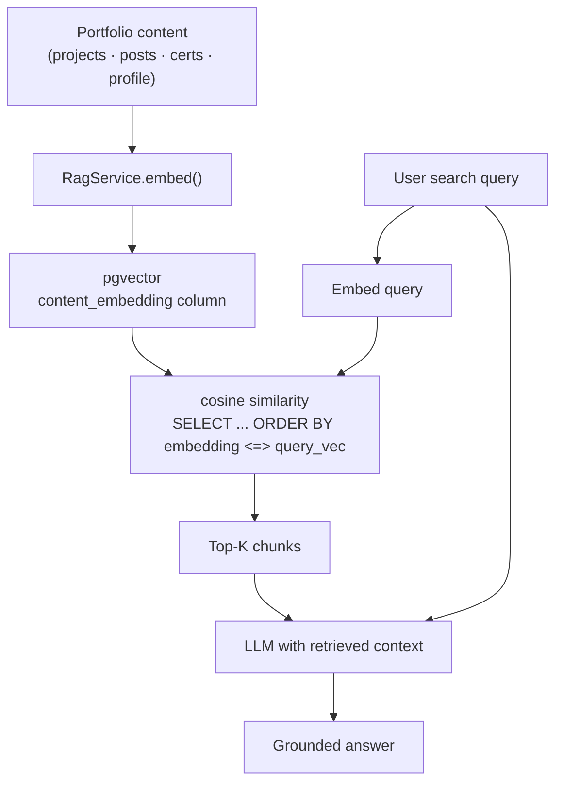
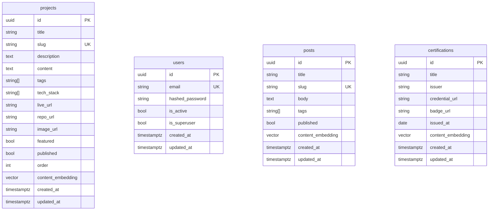
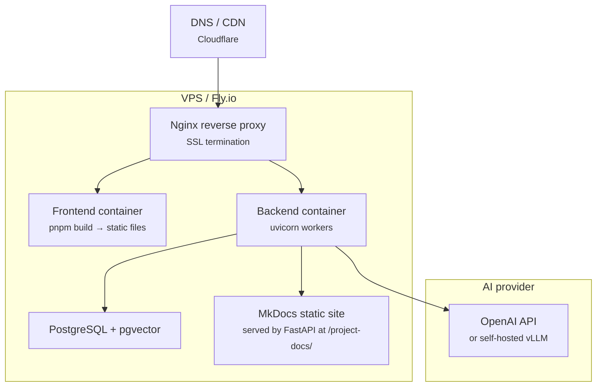

# Architecture

This document describes the overall architecture of the portfolio application — the layering rules, data-flow contracts, and the reasoning behind every structural decision.

---

## Guiding principles

| Principle | How it shows up |
|---|---|
| **Thin routes** | Route handlers parse the request and delegate — zero business logic, zero SQL |
| **Explicit layers** | Routes → Services → Repositories → Database. Cross-layer imports are forbidden |
| **Typed at every boundary** | Pydantic schemas at the HTTP boundary, SQLAlchemy models inside, never mixed |
| **Fail loudly** | Domain exceptions propagate up; global handlers map them to HTTP — no silent swallows |
| **No magic strings** | Every repeated value (model names, token limits, route prefixes) lives in `constants.py` / `constants.ts` |
| **Generated clients** | The frontend never hand-writes fetch calls — Hey API generates a typed client from the OpenAPI spec |

---

## System overview



---

## Backend layer rules



### What lives where

| Layer | File pattern | Allowed to… | Must never… |
|---|---|---|---|
| **Routes** | `api/v1/routes/*.py` | Parse request · call service · return schema | Touch DB · contain business logic |
| **Services** | `services/*.py` | Orchestrate repos · call AI · raise domain exceptions | Import routes · return raw ORM objects |
| **Repositories** | `repositories/*.py` | Issue SQL via `AsyncSession` | Raise domain exceptions · contain rules |
| **Models** | `models/*.py` | Define ORM columns + relationships | Contain any logic |
| **Schemas** | `schemas/*.py` | Validate I/O · transform data | Import from routes or services |
| **Core** | `core/*.py` | Config · exceptions · security · middleware | Import from any feature module |

---

## Request lifecycle



### Error path



!!! tip "No try/except in routes"
    Domain exceptions bubble up from the service layer through the route layer
    unchanged.  The global handlers in `app.core.error_handlers` catch them and
    produce the correct HTTP response.  This keeps every route handler to
    ~10 lines.

---

## Frontend data flow



### Component rules

| Layer | Pattern | Allowed to… | Must never… |
|---|---|---|---|
| **Route / Page** | `src/routes/**/*.tsx` | Compose hooks + components | Call `fetch` · use `useEffect` for data |
| **Domain hook** | `src/hooks/use*.ts` | Call `useAppQuery` / `useAppMutation` with generated options | Contain render logic |
| **`useAppQuery`** | `src/lib/query.ts` | Wrap TanStack Query + log errors in dev | Import from feature modules |
| **Generated client** | `src/lib/api/` | Typed fetch calls against the OpenAPI spec | Be edited by hand |

---

## AI pipeline



### RAG pipeline



---

## Database schema



!!! note "pgvector"
    Every domain model that participates in RAG search carries a
    `content_embedding vector(1536)` column.  The dimension `1536` matches
    OpenAI's `text-embedding-3-small` output.  Changing this requires a new
    Alembic migration.

---

## Auth flow

```mermaid
sequenceDiagram
    actor Admin
    participant FE as React app
    participant API as FastAPI
    participant DB as PostgreSQL

    Admin->>FE: POST /login  {email, password}
    FE->>API: POST /api/v1/auth/login
    API->>DB: SELECT user WHERE email = ?
    DB-->>API: User row
    API->>API: verify bcrypt hash
    API->>API: create_access_token(sub=user.id)
    API-->>FE: Set-Cookie: access_token=<JWT>; HttpOnly; SameSite=Lax
    FE-->>Admin: redirect to /admin

    Admin->>FE: navigate to /admin/projects
    FE->>API: GET /api/v1/projects/?published_only=false<br/>(cookie sent automatically)
    API->>API: decode_access_token(cookie)
    API->>DB: SELECT user WHERE id = sub
    DB-->>API: User row
    API-->>FE: [ProjectResponse, ...]
    FE-->>Admin: projects list
```

See the [Auth & Security guide](auth.md) for the full implementation details.

---

## Deployment topology (planned)



!!! tip "Docs embedded in the portfolio"
    The MkDocs static build output (`site/`) is served by FastAPI as a
    `StaticFiles` mount at `/project-docs/`.  No separate web server needed.
    The portfolio frontend links to `/project-docs/` as a normal `<a>` tag.
    When the project matures, this can be upgraded to a full Docusaurus site
    as a `/docs` route inside the React app itself.